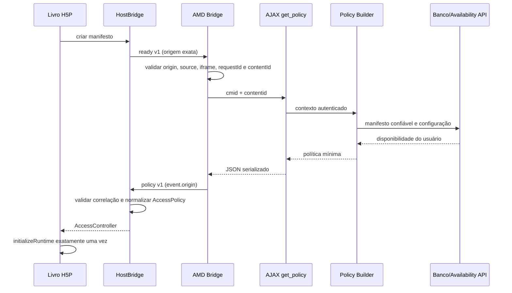

# Arquitetura da integração de acesso por capítulo

## Visão geral

A autoridade de acesso é o Moodle. O H5P aplica uma decisão pronta e não interpreta cursos, grupos, notas, conclusão ou regras da Availability API.


## Responsabilidades

| Componente | Responsabilidade | Não faz |
|---|---|---|
| Moodle | Autenticar, autorizar, localizar a atividade e hospedar o iframe | Não altera o runtime interno do livro |
| Manifest Extractor | Extrair o manifesto confiável do pacote implantado | Não confia em títulos ou capítulos enviados pelo navegador |
| Manifest Synchronizer | Persistir identidade e preservar configuração por UUID | Não migra regras por título e não apaga ausentes |
| Availability Evaluator | Avaliar `open`, `locked` e árvores Moodle por usuário | Não armazena a decisão final em cache |
| Policy Builder | Produzir somente a decisão final por UUID | Não envia JSON de condições ou dados internos do curso |
| Serviço AJAX | Validar contexto e transportar a política serializada | Não aceita um manifesto do navegador como fonte de verdade |
| AMD Bridge | Vincular a mensagem ao iframe, origem e conteúdo exatos | Não interpreta regras pedagógicas |
| HostBridge | Solicitar, validar e normalizar a resposta da plataforma | Não conhece Moodle |
| AccessPolicy | Normalizar uma política em estrutura imutável | Não acessa DOM nem cria runtimes |
| AccessController | Oferecer consultas e sequência de capítulos disponíveis | Não avalia Availability API |
| Interface do Livro | Criar conteúdo disponível e placeholders bloqueados | Não cria biblioteca filha para capítulo bloqueado |

## Identidade e manifesto

Cada capítulo é identificado pelo `subContentId`. O manifesto contém `id`, `title`, `position` e `stable`. Título e posição são metadados mutáveis. Um fallback `legacy-position-N` existe somente para manter conteúdo legado executável e não permite configuração persistente segura.

O manifesto do navegador serve para anunciar a estrutura ao host genérico. No Moodle, ele é ignorado como fonte de autorização: o servidor extrai novamente `config.chapters` do conteúdo implantado e calcula `manifesthash` determinístico.

## Contrato postMessage versão 1

### Ready: H5P para host

```json
{
  "type": "h5p-customizable-interactive-book:ready",
  "contractVersion": 1,
  "requestId": "7de9f73b-eef1-4d6a-a582-d291c9834894",
  "contentId": "123",
  "library": "H5P.CustomizableInteractiveBook",
  "chapters": [
    {
      "id": "15f0a80e-4ba1-4b51-9c4a-113e986474a8",
      "title": "Introdução",
      "position": 0,
      "stable": true
    }
  ]
}
```

### Policy: host para H5P

```json
{
  "type": "h5p-customizable-interactive-book:policy",
  "contractVersion": 1,
  "requestId": "7de9f73b-eef1-4d6a-a582-d291c9834894",
  "contentId": "123",
  "required": true,
  "teacherBypass": false,
  "chapters": {
    "15f0a80e-4ba1-4b51-9c4a-113e986474a8": {
      "available": false,
      "message": "Conclua a atividade anterior."
    }
  }
}
```

### Invariantes

- tipos de mensagem e `contractVersion` devem corresponder exatamente;
- a resposta repete `requestId` e `contentId`;
- `contentId` é textual no contrato de janela e inteiro positivo seguro no serviço;
- `chapters` é indexado por UUID do manifesto confiável;
- `message` é texto simples;
- ausência de item explícito no H5P normaliza para disponível;
- `required = false` representa integração ausente ou desabilitada;
- `teacherBypass = true` informa que a liberação decorreu da capability de bypass com o modo de edição ativo;
- nunca se usa `targetOrigin = "*"`.

## Sequência de mensagens



O `ready` pode ser reenviado durante a espera. O AMD Bridge responde uma única vez por `requestId`. O runtime do livro só é criado depois de uma política válida ou do fallback.

## Fluxo do professor

1. O professor editor abre `manage.php?cmid=N`.
2. Moodle exige login, contexto do módulo e capability `manage`.
3. O manifesto atual é extraído e sincronizado por UUID.
4. O professor habilita a integração, define mensagem e escolhe `open`, `locked` ou `conditional`.
5. Para `conditional`, o editor padrão da Availability API salva `availabilityconditionsjson`.
6. A gravação ocorre em transação e preserva títulos/posições como valores derivados do H5P.

## Fluxo do estudante

1. O estudante abre a atividade e passa pelas verificações normais de `mod_h5pactivity:view`.
2. A política é calculada sem cache compartilhado de resultado final.
3. `open` fica disponível; `locked` fica bloqueado; `conditional` é avaliado para o ID do estudante.
4. O H5P constrói bibliotecas filhas apenas para capítulos disponíveis.
5. Menu, próximo/anterior, progresso, conclusão, pontuação, resumo e xAPI usam o conjunto disponível.

## Fluxo com bypass

Um usuário com `local/h5pchapteraccess:viewlocked` recebe `teacherBypass = true` e todos os IDs disponíveis somente enquanto o modo de edição do Moodle estiver ligado. Com a edição desligada, professor e estudante recebem a mesma política. O Policy Builder retorna antecipadamente apenas no bypass ativo, sem modificar a configuração persistida dos estudantes.

## Fluxo sem plugin ou integração desabilitada

- Sem listener hospedeiro, o HostBridge encerra a espera após aproximadamente 2,5 segundos e usa `AccessPolicy.allowAll()`.
- Se a origem do `parent` não puder ser determinada, nenhuma mensagem é enviada e o mesmo fallback é usado.
- Integração desabilitada não carrega o AMD Bridge; o livro permanece funcional pelo fallback.
- Uma chamada direta ao serviço para livro desabilitado retorna `required = false` e todos disponíveis.

## Tratamento de erros

| Erro | Comportamento |
|---|---|
| Origem, source, tipo, versão ou correlação inválida | Mensagem ignorada |
| Iframe ou `contentId` não corresponde ao `cmid` | Nenhuma política enviada / exceção controlada no serviço |
| Falha AJAX | Bridge não expõe stack trace; H5P usa timeout allow-all |
| JSON H5P inválido ou biblioteca incompatível | Extração rejeitada com exceção específica |
| UUID duplicado | Manifesto rejeitado |
| Condição Moodle inválida | Avaliação fail-closed e mensagem genérica |
| Condicional sem árvore | Disponível com aviso de configuração |
| Capítulo ausente no novo pacote | Registro marcado inativo, sem exclusão da regra |
| Pacote ainda indisponível na restauração | Reconciliação adiada e registrada; lazy sync tenta novamente |
| Todos os capítulos bloqueados | Primeiro placeholder, sem resumo, score 0 e sem conclusão automática |

## Estado, pontuação e eventos

O estado primário é `chaptersById[uuid]`. O array legado é somente fallback e não substitui associação UUID após reorganização. Estado prévio de capítulo atualmente bloqueado permanece preservado.

Somente capítulos disponíveis, não-resumo e com instância válida participam de resposta fornecida, score, máximo, estado, reset, soluções, conclusão e xAPI. O resumo é criado somente se configurado e houver ao menos um capítulo disponível.

## Limites de segurança

As fronteiras implementadas evitam mensagens cruzadas entre origens/iframes, impedem confiar no manifesto do navegador e minimizam a política enviada. Elas não transformam um pacote H5P em armazenamento secreto. O fallback é deliberadamente fail-open para manter compatibilidade fora do Moodle.

**O bloqueio controla visualização, inicialização das bibliotecas filhas e navegação, mas o pacote H5P continua contendo os parâmetros originais dos capítulos. A solução não deve ser apresentada como mecanismo de proteção para informações confidenciais.**

Informação confidencial deve permanecer em recursos protegidos por autorização do servidor e não dentro dos parâmetros distribuídos do pacote H5P.
